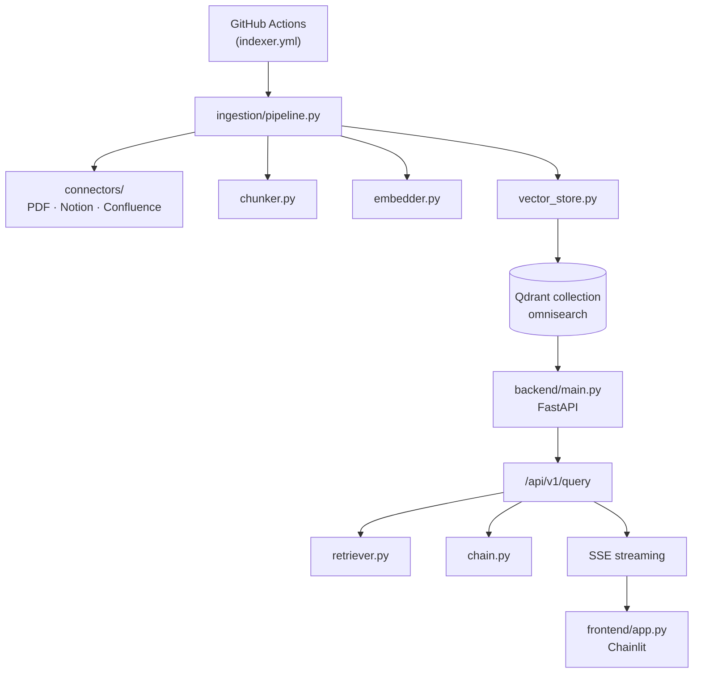

# OmniSearch

  

Internal RAG (Retrieval-Augmented Generation) system for organizational knowledge bases.

## Stack

| Component | Technology |
|---|---|
| Vector DB | Qdrant (self-hosted, Docker) |
| Embeddings | `BAAI/bge-large-en-v1.5` (HuggingFace) |
| Orchestration | LangChain + LCEL |
| LLM | OpenAI (default: `gpt-4o-mini`) · Anthropic Claude (`claude-3-5-haiku`) — swappable via `LLM_PROVIDER` env var |
| Backend | FastAPI + SSE streaming |
| Frontend | Chainlit |
| CI/CD | GitHub Actions |

## Quick Start

### 1. Configure environment

```bash
cp .env.example .env
# Edit .env with your API keys
```

### 2. Start the full stack

```bash
docker compose up --build
# Frontend available at http://localhost:8501
```

### 3. Run the ingestion pipeline

```bash
# Drop PDFs into data/sources/ then:
docker compose --profile ingestion run ingestion

# Or trigger manually via GitHub Actions → workflow_dispatch
```

## Development

```bash
# Install all dependencies
pip install -e ".[ingestion,backend,frontend,dev]"

# Start services with hot reload
docker compose -f docker-compose.yml -f docker-compose.dev.yml up

# Run tests
pytest tests/unit/ -v
pytest tests/integration/ -v   # Requires Qdrant running
```

## Architecture



## Data Sources

| Source | Connector | Env Vars Required |
|---|---|---|
| Local PDFs | `PdfConnector` | `PDF_SOURCE_DIR` |
| Notion | `NotionConnector` | `NOTION_TOKEN`, `NOTION_ROOT_PAGE_ID` |
| Confluence | `ConfluenceConnector` | `CONFLUENCE_URL`, `CONFLUENCE_USER_EMAIL`, `CONFLUENCE_TOKEN`, `CONFLUENCE_SPACE_KEY` |

## Ingestion Automation

The indexer runs automatically:
- **Nightly** at 2AM UTC (cron schedule)
- **On push** when files are added to `data/sources/`
- **Manually** via GitHub Actions → Run workflow (choose source type)

## Security

- Only the frontend port (8501) is exposed to the host
- All API keys are stored as GitHub Secrets / Docker env vars
- Qdrant and the backend communicate over an internal Docker network
- The LLM is instructed to cite sources and refuse to answer outside the knowledge base

## Stress Testing

```bash
# Place complex PDFs in tests/stress/fixtures/ then:
RUN_STRESS_TESTS=1 pytest tests/stress/ -v
```

## ADR — Why This Stack

**BGE embeddings over OpenAI embeddings** — self-hosted, no per-token cost, strong multilingual performance for organizational knowledge bases.

**Qdrant over pgvector** — purpose-built vector DB with filtering, payload indexing, and horizontal scaling; pgvector is adequate for small workloads but operationally simpler to replace than retrofit.

**Chainlit over a custom frontend** — ships streaming, source citation UI, and auth out of the box; building equivalent features from scratch would cost 2–3 weeks with no differentiated value.
